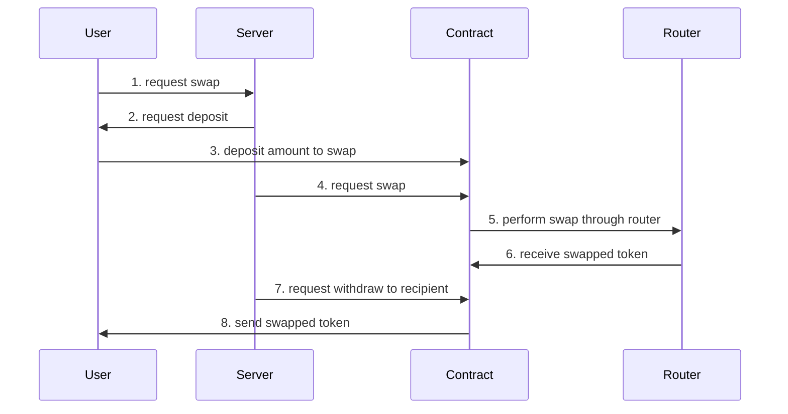
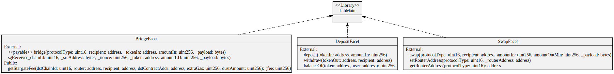

# sample-bridge-swap-aggregator

This project demonstrates how basic bridge-swap aggregator can be structured through smart contract.

# Project Description

## Details

Based on user's request, server performs all the swap & bridge procedures and sends swapped token back to recipient.

### Diagram



### Contracts



- Since using diamondcut pattern, facet contracts share same address for call.
- Check details for diamondcut pattern here: https://github.com/mudgen/diamond

### Run Test Script

run hardhat node with forked ethereum

```bash
yarn hardhat node --fork ${ ETHEREUM_RPC_URL }
yarn hardhat test --network localhost
```

### TODOs (Archived)

<details>
  <summary> archived </summary>

- [x] add deploy script
- [x] add test script
- [x] update readme

</details>
